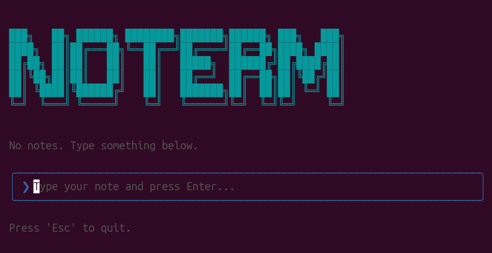

# NOTERM

> **NOTERM** is a minimalist, terminal-based note-taking application built with [Ink](https://github.com/vadimdemedes/ink) and [React](https://reactjs.org/).



## 🚀 Features

*   **Fast & Lightweight**: Runs entirely in your terminal.
*   **Persistent Storage**: Notes are automatically saved to a local JSON file.
*   **Intuitive Navigation**: Use keyboard arrows to navigate through notes.
*   **Editing**: Select and edit existing notes in place.
*   **Delete**: Easily remove notes by clearing their text.

## 📦 Installation

Clone the repository and install dependencies:

```bash
git clone https://github.com/your-username/noterm.git
cd noterm
bun install
```

## 🎮 Usage

You can run the application using Bun:

```bash
bun start
```

Or run the compiled executable (see [Development](#-development)):

```bash
./noterm
```

### Controls

| Key | Action |
| :--- | :--- |
| **Type text** + `Enter` | Create a new note |
| `↑` (Up Arrow) | Select previous note for editing |
| `↓` (Down Arrow) | Select next note |
| `Enter` (while editing) | Save changes |
| `Enter` (empty text) | **Delete** the selected note |
| `Esc` | Quit the application |

## 🛠️ Development

To build the standalone executable:

```bash
bun run build
```

This will create a `noterm` binary in the project root. You can run it directly:

```bash
./noterm
```

The application saves notes to `notes.json` in the current working directory.

## 📝 License

This project is licensed under a custom agreement.

*   ✅ **Forking**: Allowed and encouraged.
*   ❌ **Commercial Use**: Strictly prohibited (cannot be sold).
*   ❌ **Naming**: You cannot publish a copy of this exact code under the name "noterm".

See the [LICENSE](LICENSE) file for details.
